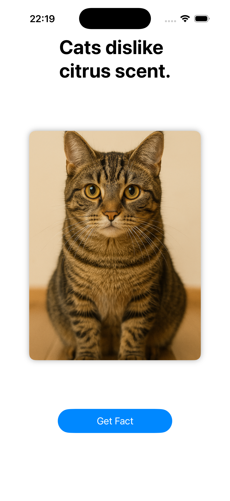

# 🐱 CatAPI SwiftUI

A simple iOS app built with **SwiftUI** as a classroom exercise at ISTEC. The app shows a random cat fact (from a public API) together with a random cat photo, each time the user taps a button.

This project was made to practice the basics of SwiftUI and how to call a REST API asynchronously in Swift.

## Screenshot

## What it does

- Shows a cat image and a short fact about cats.
- When the user taps **"Get Fact"**, the app:
  1. Calls the [catfact.ninja](https://catfact.ninja/) API to get a new random fact.
  2. Updates the text on screen with the new fact.
  3. Changes the cat photo to a different one (chosen randomly from a local set of images).

## How it works (technical overview)

- **SwiftUI** for the interface (`ContentView.swift`).
- **`URLSession`** with `async/await` to call the API without blocking the UI.
- **`Decodable`** struct (`Fact`) to convert the JSON response into a Swift object.
- Cat images are stored locally in the app's asset catalog (`Assets.xcassets`), not downloaded from the internet.

## Tech stack

| Technology | Use |
|---|---|
| Swift | Main language |
| SwiftUI | User interface |
| URLSession (async/await) | Network requests |
| catfact.ninja API | Source of cat facts |

## Requirements

- Xcode 15 or newer
- iOS 17 or newer (simulator or real device)

## How to run

1. Clone this repository.
2. Open `catAPISwiftUI.xcodeproj` in Xcode.
3. Select an iPhone simulator (or your own device).
4. Press **Run** (▶️).

No API key or extra setup is needed — the cat facts API is free and public.

## Possible improvements

This was a learning exercise, so there are a few things that could be improved in a future version:
- Fix the button label typo ("Get Factq" → "Get Fact").
- Show a loading indicator while the fact is being fetched.
- Handle network errors with a message on screen, instead of just printing to the console.
- Download cat images from an API too, instead of using only local images.

## Context

Made for a mobile development class at **ISTEC Lisboa**.
